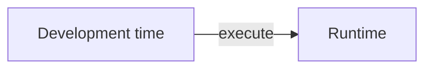
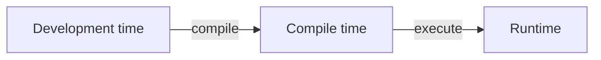
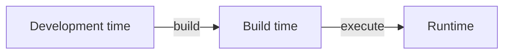

# Masterclass: Type Safety
Jurgen Beliën

---
columns: 2
---

# Welke talen kennen jullie?


::v-click{at=7}
***Static* programming languages**
::

::v-click{at=8}
***Dynamic* programming languages**
::

::v-clicks
- C/C++
- Java
- Rust
::

::v-clicks
- PHP
- Javascript
- Python
::

---
layout: divider
---
# Wat is het verschil?

---
transition: slide-up
---

# Statische taal: C

<<< @/snippets/c_example.c

::v-clicks
```bash
$ cc ./snippets/c_example.c
```

```
c_example.c:9:14: error: assigning to 'char *' from incompatible type 'float'
   9 |   string_variable = float_variable;
     |                   ^ ~~~~~~~~~~~~~~
```
::

---

# Statische taal: Rust

<<< @/snippets/rust_example.rs

::v-clicks
```bash
$ rustc ./snippets/rust_example.rs
```

```
error[E0308]: mismatched types
  --> rust_example.rs:9:18
9 |     string_var = float_var;
  |                  ^^^^^^^^^ expected `&str`, found floating-point number
```
::

---
transition: slide-up
---

# Dynamische taal: Python

<<< @/snippets/python_example.py python {monaco-run}{autorun:false}

---

# Dynamische taal: Javascript

<<< @/snippets/javascript_example.js {monaco-run}{autorun:false}

---

# Wat is het verschil?

::v-clicks{depth=2}
- Een **statische** taal staat ==niet toe dat bepaalde instructies tijdens *runtime* kunnen veranderen== en dwingt dat af dat tijdens *compile time* of *build time*.
    - Een variabele kan geen ander type krijgen dan de eerste type die het heeft gehad.
- Een **dynamische** taal staat toe dat bepaalde instructies tijdens *runtime* kunnen veranderen.
    - Een variable dat eerst een `string` was kan een `number` worden.
::

---
layout: divider
transition: slide-up
---

# Runtime, compile time, build time?

---
transition: slide-down
---
# Levensloop van software

::v-clicks



::

---
columns: 2
---

# Waarom een verschil?

::v-clicks
- In **statische** talen kunnen optimalisaties uitgevoerd worden doordat je zeker weet wat code gaat doen voordat het uitgevoerd wordt
- In **statische** talen zijn ==bepaalde bugs onmogelijk== doordat je zeker weet wat code gaat doen.
::

::v-clicks
* **Dynamische** talen zijn vergevingsgezind en flexibel. 
* Met **dynamische** talen kan je kortere code schrijven doordat je niet hoeft na te denken over het bijhouden van types.
::

---

# Voorbeeld van bugs

<<< @/snippets/javascript_bug_example.js javascript {monaco-run}{autorun:false}

---
transition: fade
---

# Defensief programmeren

::v-clicks
Eén van de manieren om dit te voorkomen is **defensief programmeren**.

<<< @/snippets/javascript_defense_example.js javascript {monaco-run}{autorun:false}

::

---

# Defensief programmeren

Eén van de manieren om dit te voorkomen is **defensief programmeren**.

<<< @/snippets/python_defense_example.py python {monaco-run}{autorun:false}

---
transition: slide-up
image: https://i.imgur.com/YqXZB81.gif
layout: divider
---

# There has to be a better way!


---

# Streng is goed

Wat als we die strengheid van **statische** talen in **dynamische** talen kunnen gebruiken?

::v-clicks
- Python heeft optionele _type hinting_ [(Python Software Foundation, 2026)](https://docs.python.org/3/library/typing.html)
    - Python zelf doet daar weinig mee, maar andere tools (zoals je IDE) kunnen kijken of hierdoor fouten ontstaan.
- Javascript heeft _type hinting_ via [JSDoc](https://jsdoc.app/tags-type) én de **strongly typed** variant [Typescript](https://www.typescriptlang.org)
    - Ook voor JSDoc zorgt ervoor dat andere tools kunnen kijken of er fouten ontstaan
    - Typescript is een nieuwe taal die te vertalen is naar Javascript in *build time*.
- PHP kan draaien in een strengere modus met `declare(strict_types=1);` aan het begin van je script. [(The PHP Documentation Group, 2017)]([https://blog.cloudflare.com/randomness-101-lavarand-in-production/](https://www.php.net/manual/en/language.types.declarations.php#language.types.declarations.strict))

---

# Type hints in Python

<<< @/snippets/python_types_example.py python {monaco-run}{autorun:false}

---

# Type safety in Typescript

<<< @/snippets/typescript_example.ts typescript {monaco-run}{autorun:false}

---
transition: slide-up
layout: divider
---

# Aan de slag

---
transition: fade
---

# Volume Calculator

<<< @/exercises/calculator.js javascript {monaco}{height: '300px'}

---
transition: fade
---

# Volume Calculator

<<< @/exercises/calculator.py python {monaco}{height: '300px'}

---

# Volume Calculator

::v-clicks
- Maak de volume calculator werkend
- Begin met **type hints** toe te voegen
- Maak daarna één van **berekeningen** werkend
- Zorg daarna dat de `shape_shortcut` werkt
- Maak daarna de **andere berekeningen** werkend
::

---
columns: 2
---

# Cheat sheet

```python
integer_example: int = 1
float_example: float = 1.0
string_example: str = "hoi"
boolean_example: bool = True
```

```python
integer_to_string = str(1)     # "1" <str>
integer_to_float = str(1.0)    # "1.0" <str>
string_to_integer = int("1.0") # 1 <int>
string_to_float = float("1")   # 1.0 <float>
```

---

# Wanneer handig?

::v-clicks{depth=2}
- Type safety helpt **consistentie** te behouden
    - Grotere codebases onderhoudbaar houden
    - Betere performance bereiken
- Type safety kan te **streng** zijn
    - Snel iets uitproberen wordt moeilijker
    - Het verplicht je meer over applicatie-ontwerp na te denken

::

---

# Bibliografie

Python Software Foundation. (2026, August 25). _typing—Support for type hints_. Python Documentation. [https://docs.python.org/3/library/typing.html](https://docs.python.org/3/library/typing.html)

The PHP Documentation Group. (n.d.). _PHP: Type declarations - Manual_. Retrieved August 26, 2026, from [https://www.php.net/manual/en/language.types.declarations.php](https://www.php.net/manual/en/language.types.declarations.php)
